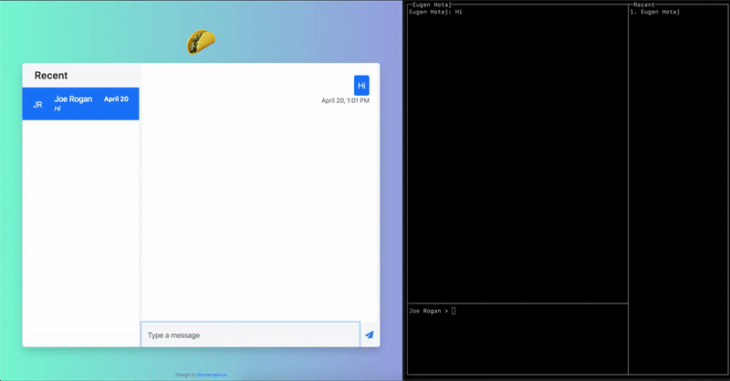
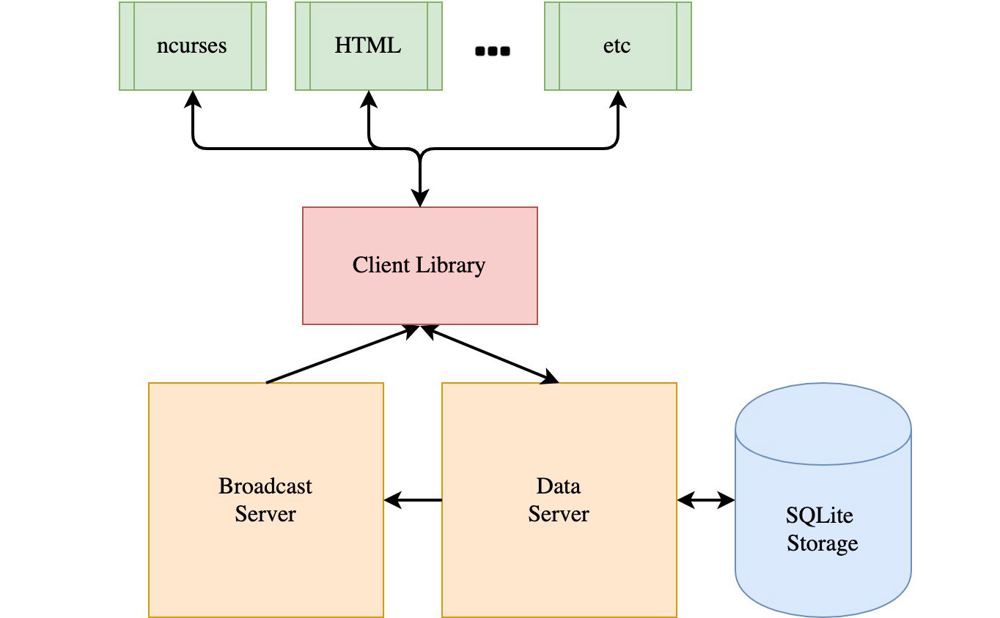

# 🌮 Talko

*A fully functioning chat application built entierly from scratch -- no HTTP, 
no requests, no frameworks.*

<div align="center">
  
  <p><i>
    Talko in action. (Left) The web application UI. (Right) The ncurses UI.
  </i></p>
</div>

Talko began as an exercise to understand how the internet works by reinventing
parts of it from the ground up. We use TCP sockets as the foundation and build
all other components from first principles, including a simple transfer 
protocol, a request/response RPC protocol, and a message streaming protocol. We
use these protocols to build a fully functioning chat application and hook up 
two front ends to it, an ncurses terminal UI, and a web application hosted
[here](http://talko-dev.herokuapp.com/?user_id=1).

## Installation

To try out Talko, clone the repository, run the commands below, then go to 
http://localhost:5000.

```shell
git clone http://www.github.com/eugenhotaj/talko
cd talko
pip install -r requirements.txt
python3 main.py \
    --ui_client=webapp \ 
    --db_path=database.db \
    --recreate_db=True \
    --insert_fake_chat=True
```

## Design

<div align="center">
  
  <p><i>High level architecture of the Talko application.</i></p>
</div>

At a high level, Talko is designed as a client-server microservice architecture.
The client communicates primarily with the `DataServer` to read and write chat
conversation data. To handle real-time messaging, the client opens a TCP socket
connection with the `BroadcastServer`. Although the socket stream is 
bi-directional, information only flows from the `BroadcastServer` to the client. 

To send a chat message, the client issues an `InsertMessageRequest` to the 
`DataServer`. The `DataServer` first stores the message in the database then
sends a `BroadcastMessageRequest` to the `BroadcastServer` with the `user_id`s 
of the message recipients. Finally, the `BroadcastServer` looks up the TCP 
socket of each connected recipient and broadcasts the message to the recipient.

In a previous design, the client would issues `InsertMessageRequest`s to the 
`BroadcastServer`, which would then both store the new message (by forwarding
the `InsertMessageRequest` to `DataServer`) as well as broadcast it to online
recipients. This greatly confused the interactions between the clients and
servers and lead to a huge bottleneck in the `BroadcastServer` as the server had
to dedicate separate threads to each connected client, even if the client was 
idle. 

We'll now go into more detail on each of the application components.

### Storage

Talko uses a `SQLite` database for ease of experimentation. The full database
schema is available in [schema.sql](talko/schema.sql). We store chat 
conversations across 3 tables, `Chats`, `Messages`, and `Participants`. The 
`Participants` table is a key-value map from `chat_id -> user_id`. Splitting out
the participants from the chats allows us to easily handle both private (i.e
one-on-one) chats and group chats.

### Protocols

The client and servers communicate with each other by sending and receiving
[JSON-RCP](https://www.jsonrpc.org/specification) messages. The communication
protocol is built entirely on top of TCP sockets and is implemented in 
[socket\_lib.py](talko/socket_lib.py). Each message consists of a `10` byte 
header followed by a `utf-8` encoded binary payload. The header simply encodes 
the size of the payload in bytes. To receive a message, we first read `10` bytes
from the socket stream then read the rest of the `n` byte payload (where `n`
is the value encoded in the first `10` bytes).

TCP sockets are primarily designed to stream data bi-directionally and do not
inherently have a concept of requests/responses. We enforce this aspect by 
ensuring that each client request receives exactly one server response, after 
which the server closes the connection with the client. To send further
requests, the client must reconnect to the server using a new socket. However,
the `BroadcastServer` keeps some connections open in order to broadcast chat
messages in real-time. 

The above more or less covers *how* the clients and servers communicate. *What*
they communicate is defined by a custom RPC protocol, implemented in 
[protocol.py](talko/protocol.py).

### Front Ends
A client library, implemented in [client.py](talko/client.py) abstracts away
communicating with both servers behind a single API. This API can then be used
to build a variety of front end, such as an ncurses terminal front end 
(implemented in [ui/curses.py](talko/ui/curses_ui.py)), a web application 
frontend (implemented in [ui/webapp](talko/ui/webapp)), etc.

The client library supports both message streaming via (async) generators as
well as long polling.

## (Potential) Future Work

* Login screen with the ability to create new user accounts
* TLS and end-to-end encryption
* Robustification -- e.g. handling bad input, dropped requests, etc
* Production database and SQL tuning
